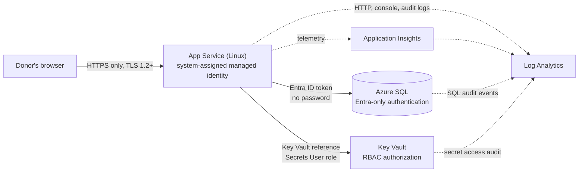

# Azure Secure Web App Baseline

[](https://github.com/peggydpy/azure-secure-webapp-baseline/actions/workflows/validate.yml)

A hardened, repeatable Azure environment for a web app and its database, built with **Bicep**, deployed and verified with **PowerShell**, and checked on every push by **GitHub Actions**.

The design goal: **zero stored credentials.** No passwords in code, in app settings, or in the database connection string.

---

## The scenario

A small nonprofit needs a donor portal: a web app backed by a SQL database. Their auditor has four requirements:

1. No passwords in code or configuration
2. Encrypted traffic only
3. Least-privilege access between components
4. Central audit logs for who accessed what

This repo meets all four, documents the trade-offs it made, and tests itself.

## Architecture



## Security decisions

| Control | How it's implemented | Why it matters |
|---|---|---|
| **No SQL passwords** | Azure SQL set to Entra-only authentication; the app connects with its managed identity | There is no password to leak, rotate or brute-force |
| **Secrets stay in Key Vault** | Third-party keys are stored in Key Vault; the app setting holds only a `@Microsoft.KeyVault(...)` reference | Secrets never appear in the portal, deployment history or source code |
| **Least privilege** | The app's identity gets *Key Vault Secrets User* on one vault, and `db_datareader` + `db_datawriter` on one database | A compromised app can't manage the vault or change the database schema |
| **Encryption in transit** | HTTPS only; TLS 1.2 minimum on the app, Kudu/SCM and SQL | Blocks downgrade attacks and plain-text traffic |
| **No basic-auth publishing** | FTP and SCM username/password publishing disabled; FTPS off | Deployments must use Entra ID |
| **Audit everything** | Diagnostic settings send app, Key Vault and SQL audit logs to Log Analytics | One place to answer "who did what, when" |
| **RBAC over access policies** | Key Vault uses Azure RBAC | Permissions are managed and reviewed like every other Azure role |
| **Recoverability** | Soft delete always on; purge protection on in prod | Accidental or malicious deletes can be undone |
| **Secret hygiene** | Secrets get an expiry date (default 365 days) | Forces a rotation review instead of keys living forever |
| **Just-in-time admin access** | The setup script opens the SQL firewall to the admin's IP only while it runs, then removes the rule | No standing firewall holes for admins |

Anything not fully locked down is recorded with a reason and a fix path in **[docs/accepted-risks.md](docs/accepted-risks.md)**.

## What's in this repo

```
.
├── infra/
│   ├── main.bicep              # Source of truth for all infrastructure
│   └── azuredeploy.json        # Compiled ARM template (generated from main.bicep)
├── scripts/
│   ├── Deploy.ps1              # End-to-end deploy: preview, confirm, deploy, grant access, test
│   ├── Grant-AppDatabaseAccess.ps1   # Maps the app's managed identity to a least-privilege DB user
│   ├── Test-SecurityBaseline.ps1     # Checks the LIVE environment for drift: PASS / WARN / FAIL
│   └── AzCli.ps1               # Shared helpers
├── tests/fake-az/              # Fake Azure CLI so tests run in CI with no subscription
├── docs/accepted-risks.md      # Risk register for every scanner suppression
├── .github/workflows/validate.yml
├── bicepconfig.json            # Linter: security rules are build-breaking errors
├── .checkov.yaml               # Security scanner config
└── PSScriptAnalyzerSettings.psd1
```

## Automated checks

Every push and pull request runs three jobs, with no Azure credentials required:

| Job | What it checks |
|---|---|
| **Bicep lint & build** | Template compiles; security linter rules (no secrets in outputs, no insecure defaults) pass; `azuredeploy.json` matches `main.bicep` |
| **Checkov security scan** | Static security analysis of the infrastructure. Results appear in the repo's **Security** tab |
| **PowerShell analysis & tests** | PSScriptAnalyzer on every script, then `Test-SecurityBaseline.ps1` runs against a fake Azure CLI. It must **pass** a secure environment and **fail** an insecure one |

## Deploy it

### Prerequisites

- An Azure subscription where you have **Owner** (or **Contributor** + **User Access Administrator**). The template creates a role assignment, which Contributor alone can't do.
- [Azure CLI](https://aka.ms/installazurecli), signed in with `az login`
- PowerShell 7+ recommended (Windows PowerShell 5.1 also works)

### Run

```powershell
git clone https://github.com/peggydpy/azure-secure-webapp-baseline.git
cd azure-secure-webapp-baseline

./scripts/Deploy.ps1 -ResourceGroup rg-donorportal-dev -AppName donorportal
```

The script shows a **what-if** preview of every change and asks before deploying. Then it grants the app database access and runs the security tests.

For production sizing (bigger SKUs, 90-day logs, purge protection):

```powershell
./scripts/Deploy.ps1 -ResourceGroup rg-donorportal-prod -AppName donorportal -Environment prod
```

### Verify any time

```powershell
./scripts/Test-SecurityBaseline.ps1 -ResourceGroup rg-donorportal-dev
```

Re-run this after anyone changes settings in the portal. It catches drift from the baseline and exits with code 1 on any failure, so it can gate a pipeline.

### Clean up

Dev uses the cheapest tiers (B1 App Service, Basic SQL), but they still bill while running. Delete everything when you're done:

```powershell
az group delete --name rg-donorportal-dev --yes --no-wait
```

## Troubleshooting

| Problem | Fix |
|---|---|
| `AuthorizationFailed` on the role assignment | You need Owner or User Access Administrator, not just Contributor |
| SQL admin setup fails with a personal Microsoft account (outlook.com, gmail.com) | Create a member user in your Entra directory, or use an Entra group as the SQL admin |
| `VaultAlreadyExists` after deleting and redeploying | A soft-deleted vault still holds the name. Run `az keyvault purge --name <vault>` (dev only) or use a new resource group |
| Grant script can't connect to SQL | Your network may block port 1433 outbound. Try another network, or run from Azure Cloud Shell |

## Roadmap

- [ ] Private endpoints for SQL and Key Vault + App Service VNet integration (removes RISK-01 and RISK-02)
- [ ] Entra **group** as SQL admin instead of a single user
- [ ] Azure Policy assignments to enforce the baseline subscription-wide
- [ ] GitHub Actions deployment using OIDC federated credentials (no stored Azure secrets)
- [ ] Sample Node.js app that reads from SQL using its managed identity

## Skills demonstrated

- **Azure:** App Service, Azure SQL, Key Vault, Log Analytics, Application Insights, managed identities, Azure RBAC, diagnostic settings
- **Security:** passwordless authentication, least privilege, encryption in transit, audit logging, risk acceptance and documentation, static security scanning (Checkov)
- **Automation:** Bicep / ARM, PowerShell, Azure CLI, GitHub Actions CI, automated compliance testing

---

Built by **Peggy Darnell** · Microsoft Certified: Azure Administrator Associate (AZ-104) · Azure Fundamentals (AZ-900)
